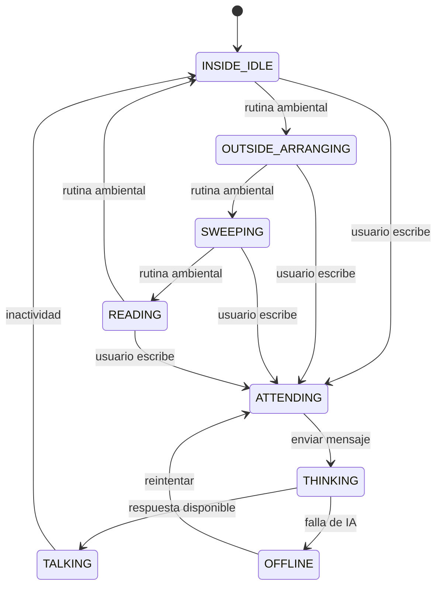
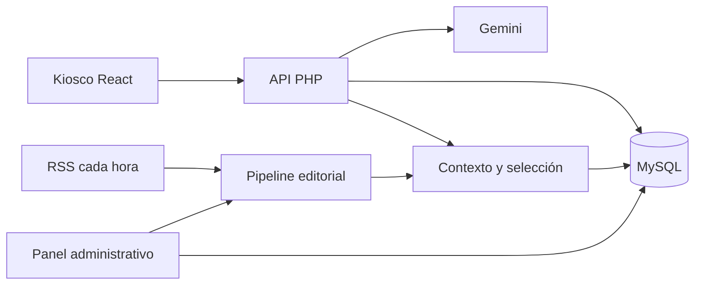
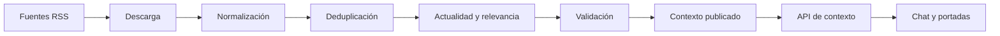
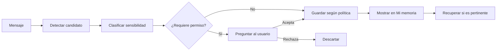

# Plan maestro de desarrollo — El Kiosco de Chacalón

**Versión:** 1.1  
**Fecha:** 31 de agosto de 2026  
**Estado:** guía de desarrollo aprobada como base de trabajo  
**Repositorio de origen:** `retro-games-streaming`  
**Repositorio nuevo:** `chacalon-kiosco`

---

## 1. Objetivo

Construir una nueva experiencia independiente de Chacalón a partir de la versión funcional de `retro-games-streaming`, conservando su conversación con IA, sus noticias, comandos y modo de respaldo, pero transformando la interfaz en un puesto de periódicos arcade vivo.

La nueva aplicación se publicará en:

- **Staging:** `https://enriquestolar.com/chacalon-lab/`
- **Producción nueva:** `https://enriquestolar.com/kiosko-chacalon/`
- **Producción anterior:** `https://enriquestolar.com/chacalon/`, intacta y separada.

No se reemplazará automáticamente la aplicación anterior.

---

## 2. Visión del producto

Chacalón es un personaje ficticio e imitador que trabaja en un puesto de periódicos del Centro de Lima. Vive en un cerro, admira la música chicha, canta con su banda y conversa con las personas que se acercan al puesto.

El usuario es un cliente o transeúnte. Puede leer titulares, preguntar por la actualidad, hablar de música, pedir recomendaciones, consultar por calles y construir una relación conversacional con memoria voluntaria.

La experiencia debe sentirse como una visita a un puesto callejero, pero representada en **pixel art arcade de 16/32 bits**. Las fotografías de referencia ayudan a definir el espacio y la actividad; no determinan el estilo visual final.

### Objetivos

- Hacer que la actualidad sea conversable y entretenida.
- Crear un mundo visual propio alrededor del kiosco.
- Ofrecer noticias recientes, variadas y con fuente.
- Permitir memoria personal con consentimiento.
- Aprender de las consultas mediante revisión editorial.
- Recomendar negocios y lugares solo con datos verificados.
- Mantener una arquitectura modular y desplegable en el hosting actual.

### Límites

- No afirmar que el personaje es el cantante real.
- No clonar voz o imagen exacta sin derechos.
- No publicar artículos ni portadas completas de terceros.
- No guardar conversaciones completas por defecto.
- No modificar automáticamente la personalidad con mensajes privados.
- No reemplazar producción hasta aprobar staging.

---

## 3. Decisiones técnicas recomendadas

| Elemento | Decisión |
|---|---|
| Repositorio | `chacalon-kiosco` |
| Base de trabajo | Copia actualizada de `retro-games-streaming` |
| Historial Git | Conservarlo para trazabilidad y rollback |
| Frontend | React, migración gradual a Vite y TypeScript |
| Backend de producción | PHP |
| Base de datos | MySQL |
| IA | Gemini exclusivamente desde el servidor |
| Automatización de noticias | GitHub Actions, sin commits horarios en `main` |
| Staging | `/chacalon-lab/` |
| Producción nueva | `/kiosko-chacalon/` |
| Producción anterior | `/chacalon/`, sin tocar |
| Memoria inicial | Anónima, opcional y controlada por el usuario |

---

## 4. Estado actual de la base

La base ya tiene capacidades que deben conservarse:

- Chat con Gemini.
- API PHP para producción.
- Proxy Node para desarrollo local.
- Personalidad de Chacalón.
- Contexto diario de noticias.
- Actualización horaria mediante RSS y GitHub Actions.
- Comandos `/`.
- Menciones `@` contextuales.
- Navegación por teclado.
- Botones para continuar la conversación.
- Memoria breve en `localStorage`.
- Música, controles y visualizador Web Audio/Canvas.
- Respuestas locales de respaldo.
- Diseño responsive.
- Pruebas de Chacalón y componentes arcade.

### Problemas a resolver antes de ampliar

- `src/games/ChacalonChat.jsx` concentra aproximadamente 1,382 líneas de responsabilidades.
- `src/styles/retro.css` concentra aproximadamente 1,533 líneas.
- Node y PHP duplican reglas de negocio y pueden divergir.
- El cron horario modifica `main`, generando conflictos y retrasos locales.
- La selección de noticias no registra cuáles ya vio cada usuario.
- La memoria solo vive en el navegador.
- No existe panel para importar, revisar y aprobar noticias.
- Los juegos arcade heredados no deben formar parte del nuevo producto final.

Antes de copiar la base hay que sincronizarla con GitHub, porque la copia local puede estar atrasada por los commits automáticos. Los logs, claves, archivos temporales y duplicados deben revisarse, no copiarse a ciegas.

---

## 5. Experiencia de usuario

### 5.1 Escena principal

La pantalla será una escena arcade interactiva compuesta por capas:

1. Calle del Centro de Lima.
2. Puesto con techo, letrero, anaqueles y mostrador.
3. Cerros y casas en el fondo.
4. Periódicos, revistas y portadas.
5. Chacalón como sprite animado.
6. Radio, escoba y objetos del puesto.
7. Interfaz de conversación.
8. Efectos CRT, luces y ambiente sonoro.

En desktop, el usuario verá el puesto completo y el chat integrado en la escena. En móvil, la conversación tendrá prioridad y el resto aparecerá en carruseles o paneles inferiores.

### 5.2 Actividades de Chacalón

Estados iniciales:

- Dentro del puesto esperando.
- Afuera acomodando periódicos.
- Barriendo o limpiando.
- Leyendo titulares.
- Escuchando la radio.
- Atendiendo al visitante.
- Pensando la respuesta.
- Conversando y gesticulando.
- Modo local cuando falla la IA.
- Ensayando con la banda como estado posterior al MVP.



Las actividades serán controladas por una máquina de estados del frontend. La IA podrá proponer un estado permitido, pero no manipular directamente la interfaz ni ejecutar acciones arbitrarias.

### 5.3 Chat

El chat funcionará prácticamente como el actual:

- Historial visible.
- Respuestas de Gemini.
- Fallback local.
- `/` para acciones.
- `@` para personas, instituciones y temas.
- Sugerencias para continuar.
- `Shift + Enter` para nueva línea.
- Navegación con teclado.
- Límite de caracteres.

La diferencia será visual: Chacalón dejará lo que está haciendo, atenderá al visitante y la respuesta aparecerá junto a él o en un panel arcade integrado.

El texto debe permanecer en HTML/React, no dibujado dentro de Canvas. Así se conserva accesibilidad, selección de texto, teclado y legibilidad.

### 5.4 Dirección artística

- Pixel art, no fotografía fotorrealista.
- Paleta arcade con influencia de gráfica chicha.
- Neón, CRT y scanlines configurables.
- Animaciones mediante sprite sheets, capas CSS o Canvas.
- Portadas reinterpretadas con diseño propio.
- Textos largos en una tipografía legible.
- Reducción de movimiento y silencio de audio disponibles.
- Arte original o con derechos autorizados.

---

## 6. Arquitectura objetivo



### Frontend

Responsable de:

- Escena arcade.
- Sprites y animaciones.
- Chat e historial.
- Portadas.
- Comandos y menciones.
- Audio y visualizador.
- Estado de conexión.
- Pantallas de memoria y preferencias.

No debe contener API keys ni decidir qué recuerdos guardar.

### API PHP

Responsable de:

- Validar entradas.
- Aplicar límites y rate limiting.
- Recuperar contexto.
- Seleccionar noticias no repetidas.
- Recuperar memoria relevante.
- Construir instrucciones de IA.
- Llamar a Gemini.
- Validar la salida.
- Registrar feedback y eventos mínimos.

### MySQL

Guardará memoria autorizada, artículos manuales, vistas de noticias, feedback, conocimiento aprobado, negocios verificados y auditoría administrativa.

### Node local

Puede permanecer como adaptador de desarrollo mientras se trabaja localmente. PHP debe ser la referencia de producción y ambos deben compartir contratos, esquemas y casos de prueba.

---

## 7. Estrategia de repositorio

### 7.1 Qué se conserva

`retro-games-streaming` se mantiene como proyecto independiente, tal como está. No se le quitan juegos, no se le cambia la ruta y no se mezcla con el nuevo desarrollo.

El nuevo repositorio parte de una copia actualizada de ese proyecto, pero sus cambios posteriores viven solamente en `chacalon-kiosco`.

### 7.2 Creación

1. Sincronizar `retro-games-streaming` con `origin/main`.
2. Revisar archivos no registrados.
3. Ejecutar pruebas y build.
4. Crear repositorio GitHub vacío `chacalon-kiosco`.
5. Clonar la historia actual en una nueva carpeta.
6. Cambiar el remoto al repositorio nuevo.
7. Crear etiqueta `streaming-baseline`.
8. Desactivar temporalmente el cron horario copiado.
9. Publicar una copia funcional en `/chacalon-lab`.

### 7.3 Reglas

- `main` debe contener código estable.
- Los cambios funcionales se hacen en `feature/*`.
- No subir `.env.local` ni claves reales.
- No subir logs ni archivos temporales.
- Cada commit debe tener un objetivo claro.
- El bot de noticias no debe modificar `main` cada hora.
- Las actualizaciones automáticas deben vivir en `context-data`, una API o un almacenamiento separado.

---

## 8. Organización propuesta del código

```text
chacalon-kiosco/
├── docs/
├── public/
│   ├── audio/
│   ├── data/
│   └── images/
│       ├── kiosk/
│       ├── character/
│       ├── newspapers/
│       └── ui/
├── src/
│   ├── app/
│   ├── components/kiosk/
│   ├── features/
│   │   ├── chat/
│   │   ├── commands/
│   │   ├── memory/
│   │   ├── mentions/
│   │   ├── music/
│   │   ├── news/
│   │   └── scene/
│   ├── services/
│   ├── domain/
│   └── styles/
├── server-php/
│   ├── api/
│   │   ├── chat.php
│   │   ├── context.php
│   │   ├── feedback.php
│   │   ├── memory.php
│   │   └── admin/
│   ├── config/
│   ├── domain/
│   └── infrastructure/
├── scripts/
└── .github/workflows/
```

### Refactor prioritario

Extraer de `ChacalonChat.jsx`:

- `useChatSession`.
- `useDailyContext`.
- `usePlayerProfile`.
- `useCommandPalette`.
- `useMentionPalette`.
- `useAudioPlayer`.
- `useCharacterState`.
- `ChatTranscript`.
- `ChatComposer`.
- `SuggestionButtons`.
- `KioskScene`.
- `CharacterSprite`.
- `NewsstandCovers`.

El refactor debe conservar la experiencia actual antes de introducir el gran rediseño.

---

## 9. Personalidad de Chacalón

La personalidad debe vivir en una fuente versionada, no duplicada manualmente dentro de dos servidores.

Orden recomendado:

1. `IDENTIDAD`.
2. `MUNDO Y OCUPACIÓN`.
3. `TONO Y LENGUAJE`.
4. `RELACIÓN CON EL USUARIO`.
5. `MEMORIA DEL USUARIO`.
6. `NOTICIAS Y ACTUALIDAD`.
7. `CALLES, NEGOCIOS Y RECOMENDACIONES`.
8. `MÚSICA Y BANDA`.
9. `REGLAS DE SEGURIDAD Y HONESTIDAD`.
10. `FORMATO DE RESPUESTA`.
11. `SALIDA ESTRUCTURADA PARA LA INTERFAZ`.

### Reglas de tono

- Cercano, creativo y directo.
- Humor ligero, sin abusar de muletillas.
- Lenguaje peruano comprensible.
- No llamar al usuario “causa” de manera automática.
- Respuestas breves por defecto.
- Ampliar cuando el usuario lo solicite.
- Seguir el tema del visitante.
- Separar hechos, opiniones y rumores.
- Reconocer incertidumbre.

### Salida estructurada

La API puede devolver, además del texto:

```json
{
  "reply": "Texto de respuesta",
  "suggestions": ["Opción 1", "Opción 2"],
  "citations": [],
  "presentation": {
    "mood": "friendly",
    "action": "talking"
  },
  "memoryCandidates": []
}
```

Los valores visuales deben validarse contra listas cerradas.

---

## 10. Noticias 2.0

### 10.1 Objetivo

Evitar que Chacalón recomiende siempre las primeras dos noticias del JSON y permitir actualización automática, agregación manual, fuentes, fechas y rotación por usuario.

### 10.2 Pipeline



Cada noticia debe tener:

- ID estable.
- Título.
- Resumen.
- Fuente.
- URL canónica.
- Fecha de publicación.
- Categoría.
- Entidades mencionadas.
- Prioridad.
- Fecha de expiración.
- Estado editorial.
- Origen automático o manual.

### 10.3 Rotación sin repetición

La selección debe:

1. Detectar tema y entidades de la pregunta.
2. Filtrar artículos vigentes.
3. Excluir artículos vistos recientemente por esa sesión o visitante.
4. Priorizar coincidencia y actualidad.
5. Introducir diversidad de fuentes y categorías.
6. Seleccionar hasta dos o tres artículos.
7. Registrar la exposición después de una respuesta válida.
8. Informar cuando se haya agotado el conjunto antes de reiniciarlo.

### 10.4 Actualización horaria

El workflow actual no debe seguir escribiendo en `main` cada hora. Para el MVP se recomienda una rama `context-data` con archivos generados. Posteriormente se puede enviar el contexto validado a un endpoint protegido o almacenamiento externo.

El sistema debe mostrar:

- Última actualización.
- Cantidad de artículos.
- Fuentes disponibles.
- Fuentes fallidas.
- Estado del último proceso.

---

## 11. Panel administrativo

Secciones iniciales:

- Estado del sistema.
- Noticias automáticas.
- Importar noticia por URL.
- Borradores.
- Aprobadas y expiradas.
- Conocimiento validado.
- Feedback.
- Preguntas sin respuesta.
- Negocios y lugares.
- Auditoría.

### Flujo de importación

```text
URL
→ validación de seguridad
→ extracción de contenido
→ borrador estructurado con IA
→ deduplicación
→ revisión humana
→ aprobación
→ publicación
```

La IA prepara el JSON, pero el administrador decide si se publica.

### Seguridad de URL

- Aceptar solo `http` y `https`.
- Bloquear localhost, IPs privadas y metadata cloud.
- Verificar DNS y redirecciones.
- Limitar tiempo, tamaño y cantidad de redirecciones.
- Sanitizar HTML.
- Tratar el texto de la página como datos, nunca como instrucciones del sistema.
- Registrar importación y decisión editorial.

---

## 12. Memoria y aprendizaje

### Capas

| Capa | Uso |
|---|---|
| Sesión | Conversación actual |
| Personal | Nombre, preferencias o datos aprobados |
| Conocimiento | Datos globales revisados por administración |
| Analítica | Métricas agregadas y minimizadas |

### Flujo



El usuario debe poder:

- Ver sus recuerdos.
- Editarlos.
- Borrarlos individualmente.
- Borrar toda la memoria.
- Desactivar la memoria persistente.

No se debe guardar información sensible sin una justificación clara y consentimiento explícito.

### Aprendizaje supervisado

Chacalón aprenderá de:

- Valoraciones 👍 y 👎.
- Preguntas sin respuesta.
- Uso de fallback.
- Correcciones de usuarios.
- Noticias repetidas o ignoradas.
- Entidades que faltan en el contexto.
- Recomendaciones insuficientes.

Estos eventos van a una cola administrativa y se convierten, después de revisión, en reglas, conocimiento validado, mejores prompts o pruebas nuevas.

No se entrenará automáticamente un modelo con conversaciones privadas.

---

## 13. Calles, negocios y recomendaciones

Cada lugar debe tener nombre, categoría, dirección, distrito, enlace, coordenadas si están verificadas, horario confirmado, fecha de última verificación y estado editorial.

Reglas:

- No inventar negocios.
- No inventar precios ni horarios.
- Mostrar la fecha de verificación.
- Diferenciar recomendación editorial de contenido patrocinado.
- Usar fuentes comprobables.
- Retirar lugares que ya no puedan verificarse.

---

## 14. Modelo de datos inicial

Tablas sugeridas:

- `visitors`: identidad anónima y preferencias.
- `sessions`: sesiones de conversación.
- `memories`: recuerdos aprobados, sensibilidad y caducidad.
- `news_articles`: artículos automáticos y manuales.
- `news_views`: artículos mostrados por visitante o sesión.
- `feedback`: valoraciones y motivos.
- `knowledge_items`: datos globales validados.
- `businesses`: lugares y verificación.
- `admin_users`: administración.
- `audit_log`: acciones administrativas.

Las tablas deben crearse mediante migraciones versionadas. Antes de cambios estructurales en producción se debe realizar backup.

---

## 15. API propuesta

### Pública

| Método | Ruta | Función |
|---|---|---|
| `POST` | `/api/chat.php` | Conversación |
| `GET` | `/api/context.php` | Noticias y estado del contexto |
| `GET` | `/api/status.php` | Estado básico del servicio |
| `POST` | `/api/feedback.php` | Valoración de respuesta |
| `GET` | `/api/memory.php` | Listar recuerdos autorizados |
| `POST` | `/api/memory.php` | Crear o modificar recuerdo |
| `DELETE` | `/api/memory.php` | Eliminar recuerdo |

### Administrativa

| Método | Ruta | Función |
|---|---|---|
| `POST` | `/api/admin/login.php` | Inicio de sesión |
| `POST` | `/api/admin/import-news.php` | Crear borrador desde URL |
| `POST` | `/api/admin/approve-news.php` | Aprobar o rechazar |
| `POST` | `/api/admin/knowledge.php` | Gestionar conocimiento |
| `POST` | `/api/admin/businesses.php` | Gestionar lugares |
| `GET` | `/api/admin/feedback.php` | Revisar aprendizaje |

Convenciones:

- JSON UTF-8.
- Errores seguros y códigos estables.
- Límites de tamaño y tiempo.
- Identificador de solicitud para diagnóstico.
- CORS restringido.
- Nunca devolver API keys, trazas sensibles o prompts internos completos.

---

## 16. Seguridad, privacidad y derechos

### Seguridad técnica

- API keys solo en servidor.
- Variables de entorno o configuración protegida.
- Rate limiting.
- Validación de JSON.
- Escape y sanitización de contenido externo.
- Protección CSRF para administración.
- Cookies seguras.
- Contraseñas con hash seguro.
- Logs sin secretos ni conversaciones completas.
- Timeouts y fallback ante Gemini.
- Pruebas de prompt injection.

### Privacidad

- Consentimiento claro y revocable.
- Recopilación mínima.
- Memoria visible.
- Eliminación verificable.
- Retención documentada.
- No mezclar usuarios.
- Analítica agregada cuando sea posible.

### Derechos

- Personaje presentado como ficción y homenaje.
- Ilustraciones originales.
- Música propia o licenciada.
- No clonar voz o identidad exacta sin autorización.
- No copiar artículos ni portadas completas.
- Usar títulos, extractos breves, fuentes y enlaces de manera responsable.

---

## 17. Requisitos no funcionales

### Rendimiento

- Optimizar imágenes a WebP/AVIF cuando corresponda.
- Usar sprite sheets compactos.
- Cargar audio y escenas bajo demanda.
- Pausar Canvas y audio en pestañas ocultas.
- Evitar fondos de varios megabytes sin necesidad.
- Medir carga en móvil.

### Accesibilidad

- Teclado completo.
- Foco visible.
- Etiquetas en controles.
- Contraste suficiente.
- `aria-live` para respuestas terminadas.
- No depender solo de color o sonido.
- Reducción de movimiento.
- Audio silenciable.

### Compatibilidad

- Chrome, Edge, Firefox y Safari actuales.
- Pantallas desde 320 píxeles CSS.
- Fallback si Canvas o Web Audio no están disponibles.
- Respuesta JSON funcional aunque el streaming progresivo falle en Freehostia.

---

## 18. Pruebas

### Unitarias

- Ranking y rotación de noticias.
- Deduplicación.
- Detección de `/` y `@`.
- Máquina de estados.
- Validación de memoria.
- Alias de noticias.
- Sanitización y límites.

### Componentes

- Chat.
- Historial.
- Formulario.
- Menús de comandos y menciones.
- Sugerencias.
- Portadas.
- Libreta de memoria.
- Estados de carga, error y fallback.
- Bandeja móvil.

### Integración

- Consulta actual con fuentes.
- Tres solicitudes de otras noticias sin repetición.
- Importación y aprobación de URL.
- Creación, recuperación y eliminación de memoria.
- Feedback administrativo.
- Falla de Gemini y modo local.

### Visuales y manuales

- Desktop y móvil.
- Chacalón dentro y fuera del puesto.
- Actividades ambientales.
- Interrupción correcta al escribir.
- Menús visibles al navegar con teclado.
- CRT activado y desactivado.
- Audio, silencio y cambio de pestaña.

Antes de cada push relevante: lint, pruebas, build, revisión de secretos, revisión del diff y smoke test.

---

## 19. Despliegue

### Staging

`/chacalon-lab/` debe tener configuración separada cuando sea posible y utilizar rutas de API propias del entorno.

### Producción nueva

La aplicación aprobada se publicará en `/kiosko-chacalon/`.

El directorio `/chacalon/` continuará sirviendo la aplicación anterior. No debe borrarse ni redirigirse como parte del primer lanzamiento.

### Checklist

1. Compilar build aprobado.
2. Verificar rutas de staging o producción.
3. Subir frontend y PHP.
4. Mantener secretos fuera del paquete.
5. Ejecutar migraciones necesarias.
6. Probar desde navegador sin sesión.
7. Revisar chat, contexto, memoria, fallback y audio.
8. Probar compartir en WhatsApp y Facebook.
9. Registrar versión desplegada.
10. Mantener backup y paquete de rollback.

---

## 20. Roadmap

### Fase 0 — Preparación

- Aprobar este plan.
- Verificar capacidades de Freehostia.
- Definir política de memoria.
- Sincronizar la base.
- Clasificar archivos locales.
- Registrar baseline.

### Fase 1 — Nuevo repositorio

- Crear `chacalon-kiosco`.
- Conservar historial.
- Proteger secretos.
- Ejecutar pruebas y build.
- Publicar copia funcional en `/chacalon-lab`.
- Aislar el cron de noticias.

### Fase 2 — Refactor

- Dividir `ChacalonChat`.
- Dividir estilos.
- Centralizar personalidad y contratos.
- Definir PHP como backend canónico.
- Crear pruebas de regresión.
- Migrar a Vite en commit separado.

### Fase 3 — Escena arcade

- Diseñar wireframes.
- Crear kiosco, calle y cerros.
- Rediseñar el letrero principal inspirado en la gráfica chicha del afiche de referencia: fondo oscuro, colores neón, lettering protagonista y composición propia.
- Integrar el reproductor de música dentro del letrero, reemplazando las ondas decorativas del diseño por el visualizador real que emite el reproductor.
- Crear sprites de espera, acomodo, limpieza, atención y conversación.
- Integrar chat y radio.
- Implementar máquina de estados.

### Fase 4 — Noticias 2.0

- Separar datos de `main`.
- Añadir IDs y expiración.
- Crear `news_views`.
- Implementar rotación sin repetición.
- Mostrar fuentes, fechas y estado de actualización.

### Fase 5 — Panel editorial

- Login administrativo (primera etapa implementada en `feature/admin-security`).
- Sesión con cookie HttpOnly, expiración y límite básico de intentos.
- CSRF para las operaciones de escritura.
- Importación segura por URL.
- Borrador con IA.
- Edición y aprobación.
- Auditoría.

### Fase 6 — Memoria

- Identidad anónima.
- Memoria personal voluntaria.
- Confirmación.
- Pantalla de revisión, edición y borrado.
- Recuperación relevante.

### Fase 7 — Aprendizaje

- Feedback.
- Preguntas sin respuesta.
- Cola administrativa.
- Reglas, conocimiento y pruebas derivadas.

### Fase 8 — Barrio y banda

- Negocios verificados.
- Calles y zonas.
- Radio y ensayo.
- Día/noche.
- Eventos especiales.

### Fase 9 — Lanzamiento

- Seguridad.
- Accesibilidad.
- Rendimiento.
- Pruebas completas.
- Backup.
- Publicación en `/kiosko-chacalon/`.
- Monitoreo posterior.

---

## 21. Alcance del MVP

Debe incluir:

- Escena arcade responsive.
- Tres actividades ambientales de Chacalón.
- Transición a atender y conversar.
- Chat equivalente al actual.
- `/`, `@` y sugerencias.
- Portadas con fecha, fuente y enlace.
- Noticias sin repetir mientras existan alternativas.
- Estado de actualización.
- Importación y aprobación manual de una URL.
- Memoria voluntaria, visible y eliminable.
- Fallback local.
- API key protegida.
- Staging independiente.

Queda para una fase posterior:

- Cuentas completas y sincronización entre dispositivos.
- Mapas avanzados.
- Voz sintética.
- Minijuegos musicales.
- Comunidad.
- Fine-tuning.

---

## 22. Criterios de aceptación

1. `/chacalon-lab/` carga en desktop y móvil.
2. `/kiosko-chacalon/` queda reservado para la producción nueva.
3. `/chacalon/` anterior permanece funcional.
4. Chacalón puede estar dentro o fuera del puesto.
5. Al escribir, pasa a atender sin perder el contexto del chat.
6. `/`, `@` y las continuaciones funcionan con mouse, tacto y teclado.
7. Tres consultas de “otras noticias” no repiten artículos válidos.
8. La actualidad devuelve fuente y fecha.
9. Una URL puede convertirse en borrador, editarse y aprobarse.
10. El usuario puede autorizar, revisar y eliminar recuerdos.
11. Gemini puede fallar sin dejar la pantalla inutilizable.
12. No hay secretos en frontend, repositorio ni logs públicos.
13. Audio y movimiento pueden reducirse o desactivarse.
14. Existe backup y rollback antes de producción.

---

## 23. Riesgos y mitigaciones

| Riesgo | Mitigación |
|---|---|
| Alcance demasiado grande | MVP cerrado y fases independientes |
| Regresiones durante refactor | Refactor funcional antes del rediseño |
| Diferencias Node/PHP | PHP canónico, contratos y pruebas |
| Cron sobre `main` | Rama o endpoint de datos separado |
| Noticias repetidas | Registro de vistas y scoring |
| Memoria invasiva | Consentimiento, revisión y borrado |
| Datos falsos | Fuentes, fechas y lenguaje de incertidumbre |
| Prompt injection | Fuentes tratadas como datos no confiables |
| SSRF en importador | Validación de DNS, IP y redirecciones |
| Limitaciones de Freehostia | Spike técnico en Fase 0 |
| Assets pesados | Optimización y carga diferida |
| Riesgo de derechos | Arte, audio y contenido editorial responsable |

---

## 24. Definition of Ready

Una fase está lista cuando:

- Tiene alcance y objetivo.
- Tiene dependencias conocidas.
- Tiene criterios de aceptación.
- Se conocen los datos y APIs afectados.
- Seguridad y privacidad fueron consideradas.
- Los assets necesarios están definidos.
- Existe forma de probarla y revertirla.

## 25. Definition of Done

Una función está terminada cuando:

- Cumple sus criterios de aceptación.
- Tiene pruebas proporcionales al riesgo.
- No expone secretos.
- Funciona en los tamaños previstos.
- Tiene estados de carga, error y fallback.
- Está documentada.
- Fue verificada en staging.
- El build y las pruebas están correctos.
- Puede revertirse sin improvisación.

---

## 26. Secuencia inmediata de trabajo

1. Aprobar este documento.
2. Sincronizar `retro-games-streaming`.
3. Revisar archivos locales no registrados.
4. Ejecutar pruebas y build.
5. Crear `chacalon-kiosco` desde la base actualizada.
6. Etiquetar `streaming-baseline`.
7. Incorporar este documento como `docs/PLAN-MAESTRO.md`.
8. Aislar la actualización horaria de noticias.
9. Publicar copia sin cambios en `/chacalon-lab/`.
10. Crear pruebas de regresión.
11. Modularizar el chat.
12. Diseñar el wireframe del kiosco arcade.
13. Crear los primeros sprites.
14. Integrar la máquina de estados con el chat.
15. Implementar rotación de noticias.
16. Construir panel editorial.
17. Construir memoria y aprendizaje supervisado.
18. Publicar finalmente en `/kiosko-chacalon/`.

---

## 27. Resultado esperado

Chacalón dejará de ser un personaje dentro de una tarjeta y pasará a vivir en un puesto arcade propio. El visitante podrá acercarse, verlo trabajar, leer titulares actuales, conversar con él, recibir recomendaciones verificadas y decidir qué cosas puede recordar.

La escena aportará vida; las noticias, actualidad; la memoria, continuidad; y la revisión humana, confianza.
